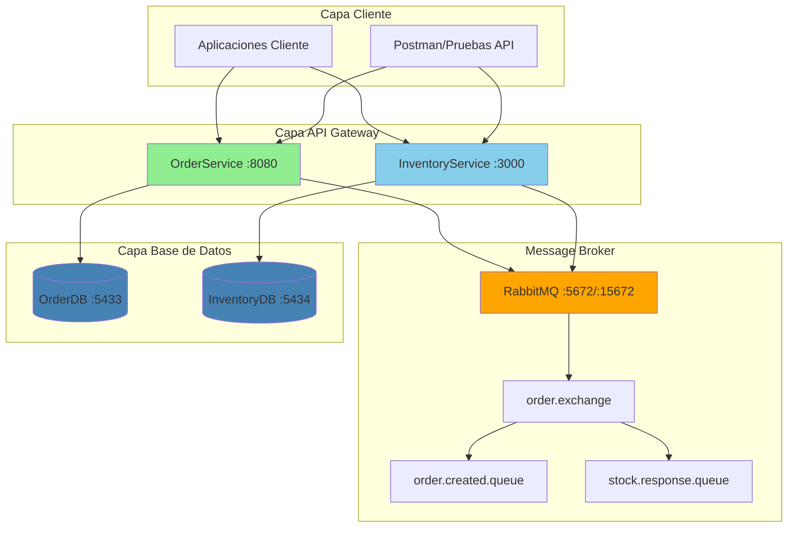
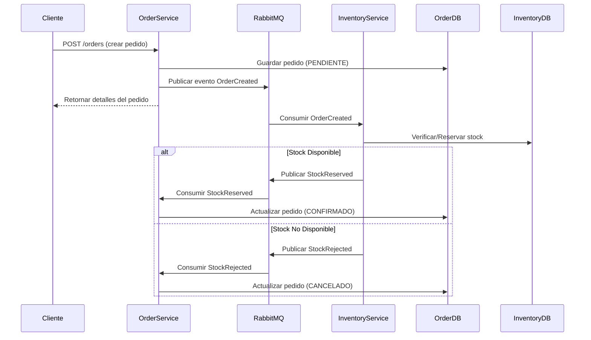

<div align="center">

# Plataforma de Microservicios E-commerce

### Gestión de Pedidos y Control de Inventario con Arquitectura Orientada a Eventos


</div>

---

## Tabla de Contenidos

- [🏗️ Resumen de Arquitectura](#️-resumen-de-arquitectura)
- [✨ Características Clave](#-características-clave)
- [🛠️ Stack Tecnológico](#️-stack-tecnológico)
- [🚀 Primeros Pasos](#-primeros-pasos)
- [🌐 Documentación de API](#-documentación-de-api)
- [🔧 Configuración](#-configuración)
- [🧪 Pruebas](#-pruebas)
- [📊 Monitoreo](#-monitoreo)

---

## Resumen de Arquitectura



### Diagrama de Flujo de Eventos



---

## Características Clave

<table>
<tr>
<td width="50%">

---

## Stack Tecnológico

<div align="center">

### **OrderService**

| Componente              | Tecnología     | Versión | Propósito                           |
| ----------------------- | --------------- | -------- | ------------------------------------ |
| **Framework**     | Spring Boot     | 3.2.1    | API REST y Lógica de Negocio        |
| **Base de Datos** | PostgreSQL      | 15       | Persistencia de Pedidos y Artículos |
| **ORM**           | Spring Data JPA | 3.2.1    | Abstracción de Base de Datos        |
| **Mensajería**   | Spring AMQP     | 3.1.1    | Integración con RabbitMQ            |
| **Runtime**       | Java            | 21       | Runtime de Aplicación               |

### **InventoryService**

| Componente              | Tecnología | Versión | Propósito                         |
| ----------------------- | ----------- | -------- | ---------------------------------- |
| **Framework**     | Express.js  | 4.18.x   | Servidor API REST                  |
| **Base de Datos** | PostgreSQL  | 15       | Persistencia de Stock de Productos |
| **ORM**           | Sequelize   | 6.35.x   | ORM de Base de Datos               |
| **Mensajería**   | amqplib     | 0.10.x   | Cliente RabbitMQ                   |
| **Runtime**       | Node.js     | 18.x     | Runtime de JavaScript              |

### **Infraestructura**

| Componente                  | Tecnología    | Versión     | Propósito                 |
| --------------------------- | -------------- | ------------ | -------------------------- |
| **Message Broker**    | RabbitMQ       | 3-management | Mensajería Asíncrona     |
| **Containerización** | Docker Compose | 3.9          | Orquestación de Servicios |
| **Motor de BD**       | PostgreSQL     | 15           | Persistencia de Datos      |

</div>

---

## Primeros Pasos

### Prerrequisitos

<table>
<tr>
<td width="33%">

### Inicio Rápido (Docker Completo)

```bash
# Clonar el repositorio
git clone <repository-url>
cd ControlLectura1

# Iniciar todos los servicios
docker compose up --build -d

# Verificar que los servicios estén ejecutándose
docker compose ps
```

**Puntos de Acceso:**

- **Gestión RabbitMQ**: http://localhost:15672 (`admin`/`admin`)
- **API OrderService**: http://localhost:8080
- **API InventoryService**: http://localhost:3000

### Modo Desarrollo (IDE + Infraestructura Docker)

<details>
<summary><b>Configuración Paso a Paso</b></summary>

#### **Paso 1: Configuración de Infraestructura**

```bash
# Iniciar solo los componentes de infraestructura
docker compose up -d rabbitmq order-db inventory-db

# Verificar que los contenedores estén ejecutándose
docker compose ps
```

#### **Paso 2: Configuración de OrderService**

```bash
# Navegar a OrderService
cd OrderService

# Limpiar y compilar
./mvnw clean compile

# Ejecutar desde IDE o línea de comandos
./mvnw spring-boot:run
```

**Verificación de Salud OrderService:**

```bash
curl http://localhost:8080/actuator/health
```

#### **Paso 3: Configuración de InventoryService**

```bash
# Navegar a InventoryService
cd InventoryService

# Instalar dependencias
npm install

# Iniciar el servicio
npm start
```

**Verificación de Salud InventoryService:**

```bash
curl http://localhost:3000/api/v1/products/health
```

#### **Paso 4: Verificar Integración RabbitMQ**

1. Abrir la UI de Gestión de RabbitMQ: http://localhost:15672
2. Iniciar sesión con `admin`/`admin`
3. Verificar **Exchanges** → existe `order.exchange`
4. Verificar **Queues** → Ambas colas están vinculadas

</details>

---

## Documentación de API

### Endpoints de OrderService

<table>
<tr>
<th width="15%">Método</th>
<th width="40%">Endpoint</th>
<th width="45%">Descripción</th>
</tr>
<tr>
<td><code>POST</code></td>
<td><code>/api/v1/orders</code></td>
<td>Crear nuevo pedido → publica evento <code>OrderCreated</code></td>
</tr>
<tr>
<td><code>GET</code></td>
<td><code>/api/v1/orders/{orderId}</code></td>
<td>Recuperar detalles del pedido y estado actual</td>
</tr>
<tr>
<td><code>PUT</code></td>
<td><code>/api/v1/orders/{orderId}?status={status}</code></td>
<td>Actualizar estado del pedido (PENDING/CONFIRMED/CANCELLED)</td>
</tr>
<tr>
<td><code>DELETE</code></td>
<td><code>/api/v1/orders/{orderId}</code></td>
<td>Eliminar pedido y artículos asociados</td>
</tr>
</table>

### Endpoints de InventoryService

<table>
<tr>
<th width="15%">Método</th>
<th width="40%">Endpoint</th>
<th width="45%">Descripción</th>
</tr>
<tr>
<td><code>GET</code></td>
<td><code>/api/v1/products/{productId}/stock</code></td>
<td>Verificar niveles de stock actuales</td>
</tr>
<tr>
<td><code>PUT</code></td>
<td><code>/api/v1/products/{productId}/stock</code></td>
<td>Actualizar cantidad de stock</td>
</tr>
<tr>
<td><code>DELETE</code></td>
<td><code>/api/v1/products/{productId}</code></td>
<td>Eliminar producto del inventario</td>
</tr>
<tr>
<td><code>POST</code></td>
<td><code>/api/v1/integration/stock-check</code></td>
<td>Probar reserva de stock → publica eventos de stock</td>
</tr>
</table>

### Ejemplos de Llamadas a la API

<details>
<summary><b>Crear Pedido</b></summary>

```bash
curl -X POST http://localhost:8080/api/v1/orders \
  -H "Content-Type: application/json" \
  -d '{
    "customerId": "9f7a1e2a-31f6-4a53-b0d2-6f4f1c7a3b2e",
    "items": [
      {
        "productId": "a3c2b1d0-6b0e-4f2b-9c1a-2d3f4a5b6c7d",
        "quantity": 2
      },
      {
        "productId": "b7e8c9d1-2f3a-4b5c-8d9e-1a2b3c4d5e6f",
        "quantity": 1
      }
    ],
    "paymentReference": "pay_abc123"
  }'
```

**Respuesta:**

```json
{
  "orderId": "123e4567-e89b-12d3-a456-426614174000",
  "status": "PENDING",
  "customerId": "9f7a1e2a-31f6-4a53-b0d2-6f4f1c7a3b2e",
  "items": [...],
  "createdAt": "2026-01-21T10:30:00Z"
}
```

</details>

<details>
<summary><b>Verificar Stock</b></summary>

```bash
curl http://localhost:3000/api/v1/products/a3c2b1d0-6b0e-4f2b-9c1a-2d3f4a5b6c7d/stock
```

**Respuesta:**

```json
{
  "productId": "a3c2b1d0-6b0e-4f2b-9c1a-2d3f4a5b6c7d",
  "availableStock": 10,
  "lastUpdated": "2026-01-21T10:30:00Z"
}
```

</details>

---

## Configuración

### Configuración de RabbitMQ

| Componente             | Configuración                                                                          |
| ---------------------- | --------------------------------------------------------------------------------------- |
| **Exchange**     | `order.exchange` (topic)                                                              |
| **Routing Keys** | `order.created`, `stock.reserved`, `stock.rejected`                               |
| **Queues**       | `order.created.queue` → InventoryService`<br>stock.response.queue` → OrderService |

### Configuración de Base de Datos

**Base de Datos OrderService (Puerto 5433):**

```sql
-- Tablas: orders, order_items
-- Datos de ejemplo: Pre-cargados vía init.sql
```

**Base de Datos InventoryService (Puerto 5434):**

```sql
-- Tabla: products_stock
-- Datos de ejemplo: 2 productos con niveles de stock
```

---

## Pruebas

### Pruebas de Flujo End-to-End

<details>
<summary><b>Prueba Completa de Flujo de Pedido</b></summary>

**Paso 1: Iniciar Infraestructura**

```bash
docker compose up -d
# Esperar a que los servicios estén saludables
```

**Paso 2: Ejecutar Servicios desde IDE**

- OrderService en puerto 8080
- InventoryService en puerto 3000

**Paso 3: Crear Pedido**

```bash
curl -X POST http://localhost:8080/api/v1/orders \
  -H "Content-Type: application/json" \
  -d '{
    "customerId": "test-customer-123",
    "items": [
      {"productId": "a3c2b1d0-6b0e-4f2b-9c1a-2d3f4a5b6c7d", "quantity": 2}
    ],
    "paymentReference": "test-payment"
  }'
```

**Paso 4: Verificar Flujo de Eventos**

1. Verificar estado del pedido: `GET /api/v1/orders/{orderId}`
2. Monitorear UI de RabbitMQ para flujo de mensajes
3. Verificar estado final del pedido (CONFIRMED/CANCELLED)

</details>

### Pruebas de Integración RabbitMQ

<details>
<summary><b>Verificación Rápida de Mensajería</b></summary>

Usar el endpoint especial de integración para probar el flujo de RabbitMQ:

```bash
curl -X POST http://localhost:3000/api/v1/integration/stock-check \
  -H "Content-Type: application/json" \
  -d '{
    "orderId": "test-order-123",
    "correlationId": "test-correlation-456",
    "items": [
      {"productId": "a3c2b1d0-6b0e-4f2b-9c1a-2d3f4a5b6c7d", "quantity": 2}
    ]
  }'
```

**Resultados Esperados:**

- El servicio de inventario publica `StockReserved` o `StockRejected`
- OrderService recibe y procesa el evento
- La UI de RabbitMQ muestra actividad de intercambio de mensajes

</details>

### Colección de Postman

Importar `postman_collection.json` para solicitudes API preconfiguradas:

- Operaciones CRUD de pedidos
- Gestión de inventario
- Endpoints de pruebas de integración

---

## Monitoreo

### Panel de Control RabbitMQ

Acceder a la interfaz de gestión en http://localhost:15672

**Métricas Clave a Monitorear:**

- Rendimiento de mensajes en exchanges
- Profundidad de colas y tasas de procesamiento
- Estado de conexiones
- Tasas de confirmación de consumidores

### Logs de Aplicación

**Logs de OrderService:**

```bash
# Seguir logs
docker compose logs -f order-service
# O desde la consola del IDE
```

**Logs de InventoryService:**

```bash
# Seguir logs
docker compose logs -f inventory-service
# O desde la consola del IDE
```

---

<div align="center">

**Licencia**
Proyecto integrador de Desarrollo de Software Seguro

Copyright © 2025 AlexGames Studios, Chavi Productions. 
All rights reserved.

</div>
